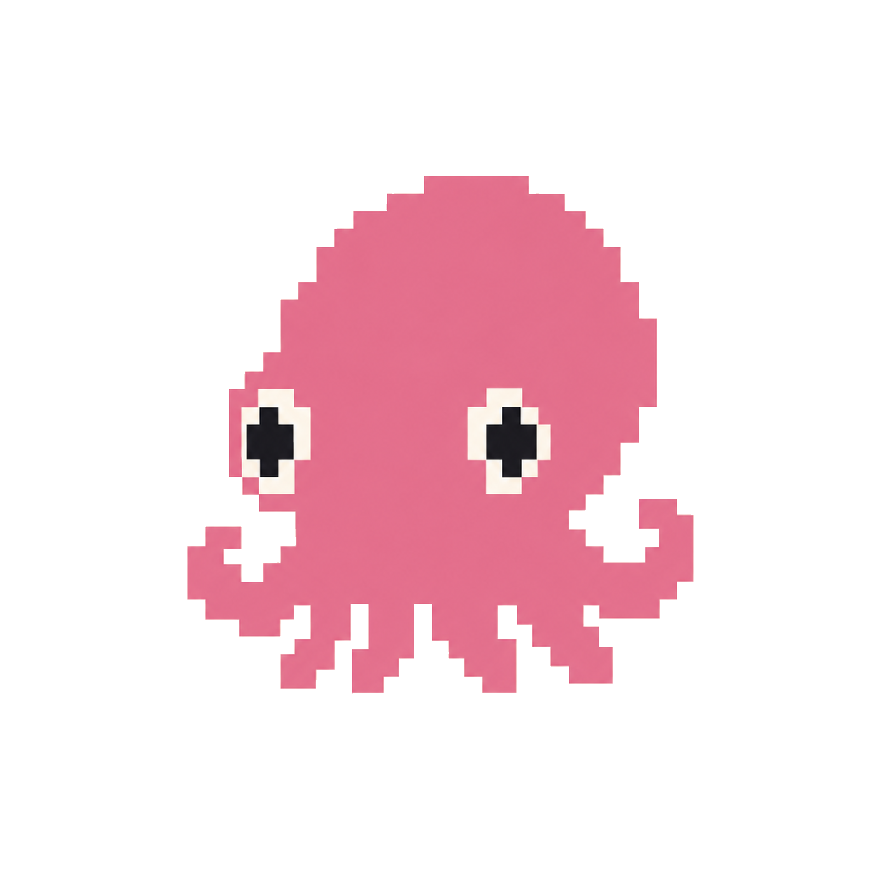
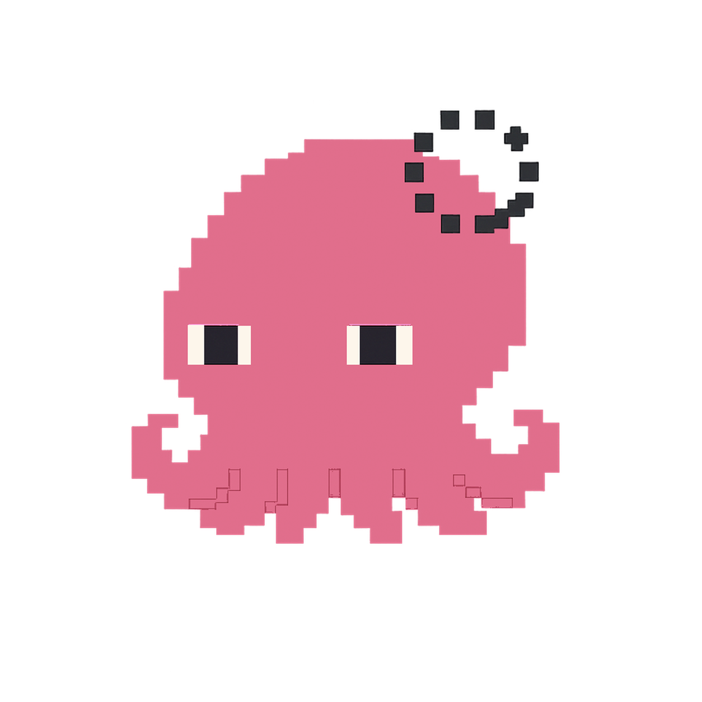

# Squid

The living interface for your AI coding agents.

Squid is a tiny desktop companion that gives you a sneak-peak to what your AI coding agents are doing — thinking, working, finishing, or waiting for you.

Today she watches Claude Code and Codex. Over time, we want Squid to become a more natural way to see, understand, and interact with the agents working for you.

> Your agents are becoming more autonomous. Squid gives them a presence.

[](docs/demo.mp4)

*Squid tracking a live session — reasoning, working, waving when she needs you, celebrating when the task lands.* ▶ **[Watch the full demo](docs/demo.mp4)** (64s, with sound)

## Why Squid?

AI coding agents can now work for minutes — or much longer — without you watching the terminal.

That creates a simple problem:

> *What are your agents doing right now?*

Squid gives that activity a persistent presence on your desktop.

You can glance over and know:

| Thinking | Working | Done | Needs you | Away |
|---|---|---|---|---|
|  |  |  |  |  |
| the agent is reasoning | files/tools are actively changing | the task finished | the agent is waiting for input or approval | you've stepped away |

Squid is deliberately small, ambient, and opinionated. She stays out of the way until you need her.

## Quick start

```bash
git clone https://github.com/sirshecomesthisway/squid-pet.git
cd squid-pet
./install.sh
```

The installer sets up the Python environment, installs dependencies, configures the macOS LaunchAgent, and starts Squid.

A cold install typically takes about 3 minutes; subsequent updates are around 30 seconds.

---

## Contents

- [Features](#features)
- [Install](#install)
- [Usage](#usage)
- [State](#state)
- [Approval-needed flag wave](#approval-needed-flag-wave)
- [Configuration](#configuration)
- [Troubleshooting](#troubleshooting)
- [For contributors](#for-contributors)
- [Requirements](#requirements)
- [License](#license)

---


## Features

- **Reacts live** to Claude Code and Codex — thinking vs. working vs. done,
  via tool-subprocess detection, recent file writes, and transcript recency
- **Waves and pings you** the instant a session needs your input — see
  [Approval-needed flag wave](#approval-needed-flag-wave)
- **Cross-tool**: also picks up git commits, terminal activity, and IDE
  (VS Code/Cursor/JetBrains) activity
- **Private by design**: every detector reads metadata only — never file
  contents, never network ([disclosure](docs/PRIVACY.md))
- **Fully configurable**: toggle any detector or behavior live via
  `~/.squid-pet/settings.json` — no restart needed
- Drag her around, right-click for a corner/pause/sprint menu,
  double-click to cycle state

---

## Install

> **Where Squid lives:** her source is in `~/Projects/squid-pet/`, runtime state in `~/.squid-pet/`, launcher at `~/.local/bin/squid`, LaunchAgent plist at `~/Library/LaunchAgents/com.pink.squid-pet.plist`. The installer is idempotent — re-running it from `~/Projects/squid-pet/` is the supported update path (or `squid update`). If you cloned somewhere else, the installer detects that and relocates the repo to the canonical location for you (post-e2e-polish 2026-06-27 Fix 5).

`./install.sh` sets up `uv venv`, installs the package from the committed
`uv.lock` against public PyPI (no dependency resolution — fast), renders the
LaunchAgent plist, drops `~/.local/bin/squid` on your PATH, writes sensible
default settings, and boots Squid. See [Quick start](#quick-start) above to
get running.

> **Want the corner/stroll prompts back?** Run `./install.sh --wizard`.
> Otherwise you get sensible defaults (bottom-right corner, edges stroll,
> show on all spaces) — edit any time in [Configuration](#configuration).

```bash
# Re-run any time to upgrade in place (idempotent):
cd ~/Projects/squid-pet && ./install.sh
```

<details>
<summary>Install timing (measured on M1)</summary>

| Scenario | Wall time |
|---|---|
| Warm install (`./install.sh` again) | **~30 seconds** |
| `squid update` (re-pull + reinstall) | **~30 seconds** |
| Cold install (fresh clone, empty `~/.cache/uv`) | **~3 minutes** |

The slow bit on a true cold install is downloading wheels for `pillow`,
`psutil`, and the `pyobjc-*` frameworks from PyPI (~15 MiB total,
throughput-bound). Every subsequent install reuses uv's wheel cache and
the committed lockfile, so resolution + downloads both get skipped.

If a clean install ever takes more than 5 minutes, run
`./install.sh --profile` and share the table from
`/tmp/squid-pet-install-profile-*.txt` — that's a regression worth
investigating.

</details>

---

## Usage

```bash
squid status         # is she alive? is the watcher ticking?
squid why            # which detector fired? what state and why?
squid doctor         # 6-check self-diagnostic
squid restart        # atomic bounce
squid update         # git pull + reinstall + restart
squid logs -f        # tail stdout+stderr live

# Uninstall cleanly:
squid uninstall              # keeps your settings + source
squid uninstall --yes --all  # nukes everything, no prompts
```

---

## State

| State | Preview | Trigger | Example |
|---|---|---|---|
| `idle` |  | Default — nothing else fires | You haven't touched anything in a while |
| `thinking` |  | Claude Code/Codex wrote a session transcript in the last 20s with no shell/file evidence | Claude Code is drafting a reply but hasn't written to a file yet |
| `working` |  | Active shell child, OR a project file was just written (Claude Code or Codex) | You ask Claude Code to edit a file and it's actively writing |
| `grooving` |  | Claude Code's Stop hook fired and no new work has resumed yet (a lighter, per-turn beat), or another detector's own grooving signal (e.g. IDE: 5+ project files touched in 30s) | Claude Code just wrapped a reply and hasn't started the next turn yet |
| `celebrating` |  | Claude Code wrote an explicit task-complete marker (`scripts/squid_task_complete.py`), Codex's busy signal dropped to idle, or another detector's celebrate signal (e.g. Git saw a fresh commit) | Claude Code judges the whole task (not just this turn) done, Codex finishes a run, or you ran `git commit` |
| `sleeping` |  | macOS HID idle > 5 min | You've stepped away from your Mac for 5+ minutes |
| `drowsy` |  | State-machine idle 300–359 s (frontend-driven) | Nothing's happened in 5+ minutes, she's about to doze off |
| `stretch` |  | Wake transition (~1.6 s, frontend-driven) | You just came back and woke her up |
| `attention_needed` |  | Claude Code session waiting on you — see [Approval-needed flag wave](#approval-needed-flag-wave) | Claude Code hit a permission prompt and is waiting on your reply |

A few more sprites in `frontend/sprites/` (`blink`, `heart`, `look-left`/`look-right`, the `*_menubar` variants) are animation frames or interaction reactions rather than separate states — see [Project layout](#project-layout).

<details>
<summary>Priority order, and forcing a state for testing/demos</summary>

Priority order is fixed (`watcher.py:StateMachine.compute`): sleeping >
celebrating-held > grooving > working > thinking > non-agent-detector busy >
idle. `approval_needed` (the flag-wave — see below) can override any of the
above. `concerned` has no detector implementation yet (a documented
non-goal), but is still settable via a debug override:

```bash
echo "celebrating" > ~/.squid-pet/force_state   # forces any state, skips natural triggers
echo "" > ~/.squid-pet/force_state              # clears the override, resumes normal computation
```

See `tests/test_state_machine.py`, `tests/test_watcher_claude_code_cascade.py`,
and `tests/test_watcher_codex_cascade.py` for the contract.

</details>

---

## Approval-needed flag wave

A separate, higher-priority alert layered on top of the state cascade
above: Squid waves and fires a macOS notification when a Claude Code
session is sitting there waiting on you.

**Signal**: `~/.squid-pet/claude_awaiting_input/<session_id>`, written by
`scripts/claude_pet_hook.py` on a `Notification` event with
`notification_type` `permission_prompt`, via Claude
Code's own official hook system (registered in `~/.claude/settings.json`).
Removed on `UserPromptSubmit` (you replied) or `SessionEnd`.

Run `squid why` / `--why-json` to see exactly what's waving and why —
it reports `claude_sessions_awaiting` / `claude_sessions_eligible`
independently.

<details>
<summary>Manual hook setup (if a machine doesn't have it wired up yet)</summary>

`~/.claude/settings.json` is personal/user-level (not tracked by this
repo), so add this `hooks` block yourself, pointing `command` at this
repo's `scripts/claude_pet_hook.py`:

```json
{
  "hooks": {
    "Notification":     [{"matcher": "", "hooks": [{"type": "command", "command": "/absolute/path/to/squid-pet/scripts/claude_pet_hook.py", "timeout": 5}]}],
    "UserPromptSubmit": [{"matcher": "", "hooks": [{"type": "command", "command": "/absolute/path/to/squid-pet/scripts/claude_pet_hook.py", "timeout": 5}]}],
    "SessionEnd":       [{"matcher": "", "hooks": [{"type": "command", "command": "/absolute/path/to/squid-pet/scripts/claude_pet_hook.py", "timeout": 5}]}]
  }
}
```

Merge this into your existing `hooks` key if you already have one, rather
than overwriting the whole file. New Claude Code sessions (and, in
practice, already-running ones — settings.json changes are hot-reloaded)
pick this up automatically; no restart required. Codex has no direct-signal
hook yet.

</details>

<details>
<summary>Self-healing and notification behavior</summary>

Two self-healing layers guard against a stuck flag: a 2h staleness prune
in `watcher.py` for a session that crashes without firing either hook, and
(2026-08-27) a same-tick check that deletes the flag outright the moment
Squid's own independent activity signal (real shell/file/streaming
evidence, nothing to do with the hook) sees the session genuinely working
again — covers Claude resuming on its own (approval granted some other
way, an agentic task continuing unattended) without a fresh top-level
prompt ever being submitted.

A 120s "seen it, deferred" snooze (fires once, then quiets down until you
reply and it fires again for genuinely new work) is enforced by
`filter_eligible_claude_sessions` in `watcher.py`, and covered by the
"Calm Squid" menu action (`snooze_all_awaiting_now`) and the
`approval_alert_enabled` kill switch.

The OS notification prefers `terminal-notifier` (if installed —
`brew install terminal-notifier`, needs a full Xcode.app to build from
source on older macOS) over plain `osascript`: `terminal-notifier`'s
`-activate <bundle-id>` makes clicking "Show" bring the actual terminal
app hosting Claude Code to the front (detected by walking the process
tree — `find_terminal_app_bundle_for_claude_code()`), instead of the
`display notification` fallback's unhelpful default (macOS attributes the
click to whatever process ran the AppleScript, generically opening an
empty Script Editor window).

</details>

---

## Configuration

Squid reads activity from a pluggable list of detectors
(`src/squid_pet/detectors.py`), each independently toggleable via
`~/.squid-pet/settings.json`. Changes are picked up live — settings.json
is hot-reloaded, no restart needed:

```json
{
  "triggers": {
    "claude_code": true,
    "codex": true,
    "git": true,
    "terminal": false,
    "ide": true,
    "project_dirs": ["~/Projects"]
  }
}
```

**`project_dirs`** is the list of roots Squid watches for file activity
(and where the `git` and `ide` detectors look). It defaults to `~/Projects`
only — **if your code lives elsewhere** (`~/dev`, `~/code`, a work folder),
add those roots here so Squid sees your IDE activity there. It's a list, so
add as many as you like; each extra root is one more directory walk per
tick, so list only roots you actively work in. Paths may use `~`.

| Detector | Signal | Feeds |
|---|---|---|
| `claude_code` | `claude` process presence, live tool subprocess, recent writes under `project_dirs`, `~/.claude/projects/*/*.jsonl` write recency | working / thinking / celebrating |
| `codex` | `codex`/`codex-tui` process presence, live tool subprocess, recent writes under `project_dirs`, `~/.codex/sessions/**/*.jsonl` write recency | working / thinking |
| `git` | `.git/{HEAD,index,refs/heads/}` mtimes under `project_dirs` | busy / celebrating |
| `terminal` | any shell with a long-lived non-shell child | busy (off by default — misfires on any dev machine with a long-running foreground process, e.g. an editor or a REPL) |
| `ide` | recent file mtimes under `project_dirs` — any editor (VS Code, Cursor, JetBrains, Zed, vim…), no per-IDE support needed. Editor-process CPU% is surfaced by `squid why` but does **not** gate the state | busy / grooving |

`claude_code` and `codex` get the full working/thinking distinction (same
cascade, OR-merged across both); the rest feed a flatter busy/idle signal.
Edit any flag to `false` to disable that detector entirely — no scans,
no process iteration, no filesystem walks for that source. Every detector
reads only metadata (process names, CPU%, file mtimes) — never file
contents, never network. Full per-detector data-access table:
[`docs/PRIVACY.md`](docs/PRIVACY.md). Run `squid why` to see exactly which
detector fired on the current tick.

---

## Troubleshooting

If Squid seems missing, run the doctor:

```bash
python -m squid_pet --doctor
```

This runs 6 checks (process, state.json freshness, launchd, window
visibility, window-not-wedged, startup log markers). Exit code 0 =
healthy; otherwise the failing check number tells you what's broken.
See [docs/STARTUP_SAFETY.md](docs/STARTUP_SAFETY.md) for the full
four-layer defense documentation.

---

## For contributors

<details>
<summary><strong>Architecture</strong></summary>

```
┌────────────────────────────────────────────────────────────────────────┐
│ watcher.py     (background thread, 1 Hz)                               │
│   detectors.py → pluggable Detector list (claude_code, codex, git,    │
│                  terminal, ide) — see "Detectors & triggers"           │
│   psutil → find claude / codex procs, aggregate CPU%                  │
│   ioreg  → macOS HID idle                                              │
│   mtime  → ~/.claude/projects/…, ~/.codex/…, .git/…,                  │
│            ~/.squid-pet/claude_awaiting_input/… (flag-wave only,      │
│            written by scripts/claude_pet_hook.py via Claude Code's    │
│            own Notification/UserPromptSubmit/SessionEnd hooks)        │
│   ────────────────────────────────────────────────────                 │
│   StateMachine.compute() — priority cascade over detector signals      │
│   ↓                                                                    │
│   api.update(state)  +  write ~/.squid-pet/state.json (atomic)        │
└────────────────────────────────────────────────────────────────────────┘
                              ↓
┌────────────────────────────────────────────────────────────────────────┐
│ window.py      (main thread — pywebview window)                        │
│   ┌──────────────────────────┐  ┌──────────────────────────────────┐   │
│   │ routine.py               │  │ passthrough.py                   │   │
│   │  RoutineController       │  │  PassthroughController           │   │
│   │  IDLE_ROUTINE: rest →    │  │  PIL alpha masks at 30 ms;       │   │
│   │  look → walk-short →     │  │  toggles NSWindow                │   │
│   │  rest → walk-medium →    │  │  ignoresMouseEvents based on     │   │
│   │  look → rest → walk-edge │  │  cursor-over-transparent pixel.  │   │
│   │  Pauses on mood ∈        │  │                                  │   │
│   │  {drowsy, sleeping,      │  │                                  │   │
│   │  stretch}; resets to     │  │                                  │   │
│   │  idx=0 on sleep wake.    │  │                                  │   │
│   └──────────────┬───────────┘  └──────────────────────────────────┘   │
│                  ↓ dispatches                                          │
│   ┌──────────────────────────────────────────────────────────────────┐ │
│   │ wanderer.py  (service mode — no internal scheduler)              │ │
│   │   request_walk(band)          band ∈ {short, medium, edge}       │ │
│   │   request_look_around()       look-around with direction flip    │ │
│   │   sprint_perimeter()          right-click → "sprint!" easter egg │ │
│   └──────────────────────────────────────────────────────────────────┘ │
│                                                                        │
│   menu.py    right-click NSMenu (corners, pause, sprint, quit)         │
│   PetApi     JS bridge: get_state / next_corner / move_window_by /     │
│              force_state / drag_start / drag_end / notify_mood / quit  │
└────────────────────────────────────────────────────────────────────────┘
                              ↓
┌────────────────────────────────────────────────────────────────────────┐
│ frontend/index.html   (transparent webview content)                    │
│     + 9 CSS @keyframes (one per state)                   │
│   800 ms poll → api.get_state() → flip [data-state="…"]                │
│   Mood transitions (drowsy/sleeping/stretch) → api.notify_mood(mood)   │
│   Mouse: drag → move_window_by, contextmenu → next_corner, dbl → cycle │
└────────────────────────────────────────────────────────────────────────┘
```

</details>

<details>
<summary><strong>Project layout</strong></summary>

```
src/squid_pet/
├── __init__.py
├── __main__.py              # CLI entry: --check, --watcher-only, default=full
├── watcher.py               # state detection + StateMachine (priority cascade)
├── detectors.py             # pluggable Detector classes (claude_code, codex, git, terminal, ide)
├── window.py                # pywebview window + PetApi (JS bridge)
├── routine.py               # RoutineController — IDLE_ROUTINE scheduler
├── wanderer.py              # service-mode walks + look-around + sprint
├── passthrough.py           # NSWindow click-through via PIL alpha masks
├── menu.py                  # right-click NSMenu (corners, pause, sprint)
└── frontend/
    ├── index.html           # sprite element + CSS keyframes + JS poller
    └── sprites/             # PNG art for every state
        └── _originals_with_bg/   # before-bg-removal originals (back-up)

tools/
└── remove_bg.py             # flood-fill alpha removal for sprite art

launchagent/
├── com.pink.squid-pet.plist
└── install.sh

tests/
├── test_state_machine.py    # priority-cascade branches + cross-tick memory
└── test_detectors_*.py      # one file per detector, injected dependencies

openspec/                    # OpenSpec specs + changes (see "Specs" below)
```

</details>

<details>
<summary><strong>Tests</strong></summary>

```bash
.venv/bin/pytest
```

648 tests, ~1m45s. Covers every state-machine branch + cross-tick memory
(burst-suppression busy_streak, `agent_idle_seconds` tracking, celebration
transition window) plus each detector in isolation. I/O is monkey-patched
or dependency-injected so the suite never touches psutil / filesystem /
ioreg in real life.

</details>

<details>
<summary><strong>Sprite tooling</strong></summary>

The artwork generator produces PNGs with solid backgrounds. `tools/remove_bg.py`
flood-fills from all 4 corners with a colour-tolerance and sets matching pixels'
alpha to 0:

```bash
# Strip background from one or many sprites (backs up originals first)
python tools/remove_bg.py src/squid_pet/frontend/sprites/idle.png \
    --backup-to src/squid_pet/frontend/sprites/_originals_with_bg

# Bulk-process every PNG in a directory
python tools/remove_bg.py src/squid_pet/frontend/sprites/ --recursive \
    --backup-to src/squid_pet/frontend/sprites/_originals_with_bg

# Verify (non-destructive): check that all 4 corner pixels have alpha=0
python tools/remove_bg.py --verify src/squid_pet/frontend/sprites/*.png
```

Tolerance defaults to 30 (Euclidean RGB distance). Bump it up for noisier
backgrounds.

</details>

<details>
<summary><strong>State file</strong> (<code>~/.squid-pet/state.json</code>)</summary>

Rewritten atomically every second. Schema:

```json
{
  "state": "thinking",
  "sub_state": "",
  "idle_seconds": 3.2,
  "agent_idle_seconds": 12.4,
  "claude_code_running": true,
  "codex_running": false,
  "timestamp": 1780819113.12,
  "message": "thinking",
  "concern_reason": "",
  "concern_severity": "",
  "state_reason": "claude streaming"
}
```

(`agent_idle_seconds` keeps its historical name for schema stability — it's
generic, tracking seconds since the state machine last left an "active"
state.)

</details>

<details>
<summary><strong>Tuning</strong></summary>

Edit the constants near the top of `watcher.py`:

| Constant | Default | Meaning |
|---|---|---|
| `POLL_INTERVAL_SEC` | 1.0 | How often the watcher fires |
| `IDLE_THRESHOLD_SEC` | 300 | macOS idle → sleeping |
| `CPU_BUSY_THRESHOLD` | 5.0 | Min CPU% to count as busy |
| `TOOL_ACTIVE_WINDOW_SEC` | 8 | Recent tool-file write → working (vs thinking) |
| `SUBAGENT_ACTIVE_WINDOW_SEC` | 30 | Subagent `.pkl` written within N sec → grooving |
| `CELEBRATE_DURATION_SEC` | 4 | How long celebrating sticks after CPU drops |
| `CONCERN_LOOKBACK_SEC` | 60 | Hard errors stay concerned this long |
| `CONCERN_TRANSIENT_LOOKBACK_SEC` | 20 | Network/timeout errors auto-clear faster |

</details>

<details>
<summary><strong>Specs (OpenSpec)</strong></summary>

This project uses **OpenSpec** to track behavior contracts. Canonical specs
live in `openspec/specs/` and any proposed change ships as an
`openspec/changes/<name>/` folder (proposal + design + tasks + spec delta)
before being archived.

```bash
openspec list              # see active changes
openspec validate <name>   # validate a change
openspec archive <name>    # merge delta into canonical spec
```

Current canonical specs:
- `autonomous-motion` — wandering, look-arounds, idle routine, mood gating
- `user-interactions` — drag, right-click menu, double-click, pokes
- `pet-reactions` — hearts/celebrations on user interaction
- `state-detection` — watcher signal sources + priority cascade
- `pet-window` — frameless transparent window, corner snap, persistence
- `pet-animations` — sprite + CSS keyframe contract
- `click-passthrough` — transparent-pixel click-through mechanism

</details>

---

## Requirements

macOS 12+, Homebrew. `uv` is auto-installed if missing.
Full manual install steps + troubleshooting: [`docs/INSTALL.md`](docs/INSTALL.md).
Privacy disclosure: [`docs/PRIVACY.md`](docs/PRIVACY.md).

---

## License

The code in this repository is [MIT licensed](LICENSE).

The Squid character artwork (`src/squid_pet/frontend/sprites/`) and the
"Squid" name/likeness are **not** open source — they're part of the Squid
brand and remain all rights reserved. See
[`src/squid_pet/frontend/sprites/LICENSE`](src/squid_pet/frontend/sprites/LICENSE)
for what that does and doesn't allow.

---

Squid is small on purpose.

She is not another dashboard.

She is the little presence that tells you what your agents are doing.
