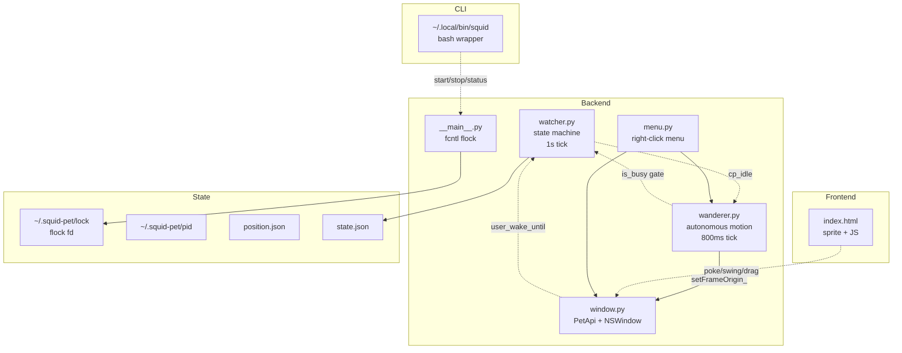

## Design

### Architecture diagram



### User-interactions: gesture detection model

Gestures live where their data is. Click/drag/dblclick start in the frontend
because that's where DOM events fire. Swing detection lives in the backend
drag loop because Python already polls cursor at 60Hz via `NSEvent.mouseLocation()`
and JS mousemove is unreliable when Python owns the cursor.

| Gesture | Detection layer | Mechanism |
|---|---|---|
| Poke | Frontend | mousedown+mouseup within 250ms and <6px movement, deferred 260ms for dblclick disambiguation |
| Dblclick | Frontend | DOM dblclick event, cancels pending poke |
| Drag | Frontend trigger, backend execution | mousedown starts `api.drag_start()`, Python takes over with native NSEvent loop |
| Swing-to-wake | Backend (in drag loop) | 4 y-direction reversals (>=8px each) within 0.6s sliding window |
| Right-click | Backend (global NSEvent monitor) | Bypasses WKWebView so it works even when sprite is click-passed-through |

### Autonomous motion: separation from animations

`pet-animations` (existing) handles sprite-frame changes driven by state.
`autonomous-motion` (new) handles WINDOW POSITION changes driven by the
wanderer's own logic. The two are orthogonal: a sprite swap from idle to
working doesn't move the window; a wander step doesn't change the sprite.

The wanderer respects an `is_busy` callback supplied by the API at construction:

```python
WanderController(
    ...,
    is_busy=lambda: (
        api.get_state().get("state") in ("thinking", "working")
        or (bool(api.get_state().get("code_puppy_running"))
            and api.get_state().get("idle_seconds", 999) < 30)
    ),
)
```

"Busy" means CP is genuinely chewing OR the user is actively driving CP
(typed within 30s). Otherwise wander runs — even if a stale CP process exists
in the background.

### Pet-window: atomic singleton via fcntl.flock

Earlier "check pid alive then write pid" was a race: two concurrent launches both saw "no live pid" and both wrote. Replaced with `fcntl.flock(fd, LOCK_EX | LOCK_NB)`
on `~/.squid-pet/lock`. The kernel guarantees atomicity. The fd is kept
alive in module globals; atexit cleans up but SIGKILL also releases the lock
via kernel fd cleanup.

### Pet-window: multi-Space persistence

`NSWindow.setCollectionBehavior_(273)` =
`canJoinAllSpaces(1) | stationary(16) | fullScreenAuxiliary(256)`.
Must be called via `AppHelper.callAfter` from the loaded event handler so
it runs on the main thread after NSWindow exists.

### State-detection: user-wake override channel

`_user_wake_until: float` epoch is set to `now + 60s` on poke or swing.
Exposed in `get_state` as `user_wake_remaining` (seconds, clamped >=0).
Frontend `checkDrowsyState()` returns early or fires `wakeUpWithStretch()`
when `user_wake_remaining > 0`. This is a separate channel from CP-activity
idle reset: a user gesture doesn't reset `cp_idle_seconds` (that would lie
about CP state), it just temporarily overrides drowsy.

### Reusability hooks for future work

- `user-interactions` capability is the natural home for future gestures
  (hover hint, scroll-to-resize, modifier-click for menus).
- `autonomous-motion` capability is the natural home for future behaviors
  (return-to-corner-after-idle, follow-cursor-mode, dance-on-celebrate).
- The `_user_wake_until` epoch pattern is reusable for other "temporarily
  override state-machine" needs.

### What this does NOT touch

- No changes to `click-passthrough` capability.
- No changes to `pet-animations` keyframe definitions.
- No new sprite assets.
- No new Python dependencies.
