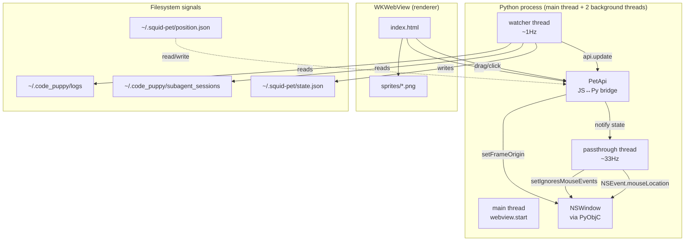

## Context

Squid runs on macOS and renders a 200×220 always-on-top, transparent, frameless
window in a corner of Pink's screen. Inside the window is a pywebview WKWebView
that loads a local `file://` HTML page; the page displays a single `` with
one of seven sprite PNGs, animated via CSS keyframes.

The hard parts of the project were not the UI but the OS-level integration:
- Getting an accurate corner position on a multi-display Mac
- Letting the user drag the window without requiring macOS Accessibility
  permission (Pink is not an admin on her work Mac)
- Making the transparent portion of the window genuinely click-through so it
  doesn't block whatever Confluence/IDE window is behind Squid
- Detecting "what Code Puppy is currently doing" from outside the agent

This design documents the architecture that solves those four problems.

## Goals / Non-Goals

**Goals:**
- Show, at a glance, which of 7 states Code Puppy is in.
- Always-on-top, frameless, transparent — like a Tamagotchi on the desktop.
- Drag anywhere on Squid's body to move her; right-click to snap to corners.
- Transparent regions of the window must not block clicks to apps behind.
- Works on a locked-down Mac (no admin, no Accessibility permission).
- Survives multi-display / Stage Manager / scaled-resolution setups.

**Non-Goals:**
- Cross-platform (Linux / Windows are out of scope — uses Cocoa directly).
- Multi-window / multi-pet (single instance per user).
- Telemetry, analytics, or any network I/O.
- AI inside Squid (she only reflects state; she doesn't generate replies).
- A general "agent dashboard" — this is an *ambient* indicator, not a control panel.

## Decisions

### D1. Native NSWindow control via PyObjC (not pywebview's `easy_drag`)

pywebview's `easy_drag=True` triggers a macOS Accessibility-permission prompt
that Pink cannot grant (she's not admin on her work Mac). Pywebview's
`window.move(x, y)` API also had unreliable multi-display coordinates.

**Decision:** Manage the NSWindow directly via PyObjC.
- `NSScreen.mainScreen().visibleFrame()` for accurate logical geometry
  (excludes menu bar + dock, works on multi-display).
- `NSWindow.setFrameOrigin_(NSPoint(x, y))` for moves — Cocoa-native, no
  permission prompts.
- `NSEvent.mouseLocation()` for global cursor polling (works regardless of
  window's mouse-event ignore state).

### D2. JS-driven drag rather than `-webkit-app-region: drag`

`-webkit-app-region: drag` did not work reliably in pywebview's WKWebView build.

**Decision:** JS listens for `mousedown` / `mousemove` / `mouseup`, computes
`event.screenX/Y` deltas, and calls `api.move_window_by(dx, dy)` over the
pywebview JS↔Python bridge. Python applies the delta via
`NSWindow.setFrameOrigin_`.

### D3. Pixel-perfect click-passthrough via alpha-mask hit testing

Setting `setIgnoresMouseEvents_(True)` on the whole window makes it
non-interactive entirely. Setting it `False` blocks every pixel in the 200×220
window — including the transparent corners that the user expects to click
through.

**Decision:** A background polling thread checks the global cursor location at
~33 Hz. It maps the cursor to a sprite-local pixel, reads the alpha of the
currently displayed sprite at that pixel, and toggles
`setIgnoresMouseEvents_(True/False)` based on whether the pixel is opaque
(α > 30) or transparent.

The thread is paused during active drag so the toggle never drops mid-motion.

### D4. State machine reads side-channels (no Code Puppy modification)

Squid must not require any change to Code Puppy itself.

**Decision:** Read four side-channel signals:
- `psutil` process scan for `code-puppy` / `code_puppy` in cmdline + CPU%
- `ioreg -c IOHIDSystem` for macOS HID idle time (no PyObjC needed)
- mtime of `~/.code_puppy/logs/log_*.txt` (recent log writes ⇒ tool calls)
- mtime of `~/.code_puppy/subagent_sessions/*.pkl` (subagent active)
- mtime of `~/.code_puppy/logs/errors.log` (recent error)

A priority-ordered cascade picks one state per tick (see `state-detection` spec).

### D5. Sprite + CSS animations (no JS animation loop)

**Decision:** Each of the 7 states maps to a PNG with a transparent
background. CSS `@keyframes` defines the per-state motion (breathe, tilt,
shake, bounce, jump, tremble, slow-breathe). State changes swap the ``'s
`src` and `data-state` attribute, which switches the active animation. A
short opacity transition cross-fades between sprites.

### D6. Architecture diagram

**Thread map:**
- **main**: `webview.start()` (event loop), PetApi method invocations
- **watcher** (daemon): polls signals, writes `state.json`, updates `PetApi`
- **passthrough** (daemon): polls `NSEvent.mouseLocation()`, calls
  `NSWindow.setIgnoresMouseEvents_` from background thread (safe — it's a
  property setter, not a UI mutation)

## Risks / Trade-offs

| Risk | Mitigation |
|---|---|
| `setIgnoresMouseEvents_` from background thread may race with redraws | Acceptable — it's an idempotent property, not a UI op; toggles only fire when value would change |
| 33 Hz polling adds CPU overhead | Measured: < 0.5% CPU at idle; cheap PIL `getpixel` reads |
| Sprites must have transparent backgrounds or the whole window will look opaque | Build-time flood-fill from corners (`tools/remove_bg.py`); originals backed up in `sprites/_originals_with_bg/` |
| pywebview future versions may change WKWebView setup | Pinned via `pyproject.toml`; if drag breaks, fall back to `easy_drag=True` (requires accessibility) |
| State detection is heuristic, not authoritative | Acceptable — Squid is ambient. False "thinking" during a long compile is fine |
| Multi-monitor + dragging Squid to secondary display | NSEvent.mouseLocation returns coords in primary-screen space; cross-display drag is best-effort |
