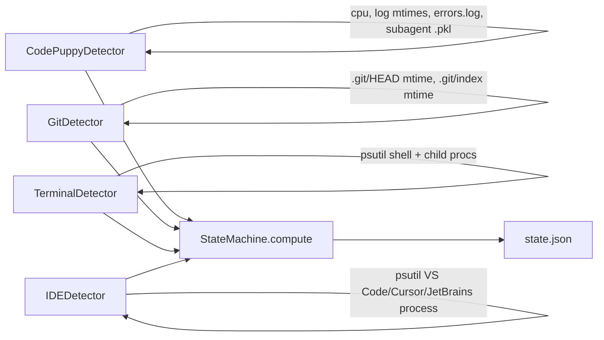

# Design — trigger-broadening

## Architecture: pluggable detector list



All four detectors run on the watcher thread. Each returns three booleans
per tick: `is_busy(now)`, `is_celebrating(now)`, `is_grooving(now)`.
StateMachine ORs them. This keeps the priority cascade unchanged — just
broader inputs.

## Detector API

```python
class Detector(Protocol):
    name: str
    enabled: bool

    def is_busy(self, now: float) -> bool: ...
    def is_celebrating(self, now: float) -> bool: ...
    def is_grooving(self, now: float) -> bool: ...
    def diagnostic(self) -> dict: ...   # for `squid why` output
```

Each implementation is also free to expose detector-specific fields (e.g.,
`CodePuppyDetector.cpu_percent`) so the existing `state.json` payload
contract stays backward-compatible.

## D1: GitDetector watches `.git/HEAD` and `.git/index` mtimes

For each path in `triggers.project_dirs`, recursively find `.git/HEAD` files
(capped at depth 4 to avoid scanning `node_modules` / `.venv`). For each:

| File mtime | Means | Squid signal |
|---|---|---|
| `.git/HEAD` modified within 5s | Just committed/checked out branch | `is_celebrating=True` for 4s |
| `.git/index` modified within 5s, HEAD unchanged | Just staged files | `is_busy=True` |
| `.git/refs/heads/` modified within 5s, HEAD unchanged | Just pushed | `is_celebrating=True` for 4s |

No file content is read. No `git` shell-out. Just `os.stat()` on three
filesystem paths.

Cap: scan up to 50 repos. Cache directory list for 60s to avoid hammering
the filesystem.

## D2: TerminalDetector watches psutil for active shells with children

A shell (zsh/bash/fish) with no children is idle. A shell with a non-shell
child process running for >3s is "actively running a command". Map:

```python
def scan(self) -> int:
    """Returns count of shells with active long-running children."""
    count = 0
    for p in psutil.process_iter(['name','pid','create_time']):
        if p.info['name'] not in {'zsh','bash','fish'}: continue
        for child in p.children():
            if child.info['name'] in {'zsh','bash','fish'}: continue
            if (time.time() - child.info['create_time']) < 3: continue
            count += 1
            break
    return count
```

`is_busy=True` when count >= 1. No `is_celebrating` (would need exit-code
detection, deferred to v2). No `is_grooving` (terminal work doesn't have a
"creative burst" signature).

## D3: IDEDetector watches process CPU + recent project file mtime

Process names matched against `triggers.ide_processes` (default
`["Code", "Cursor", "idea", "pycharm", "webstorm"]`). For each matched
process aggregate CPU%.

| CPU% | Project file modified <5s ago | Signal |
|---|---|---|
| ≥3% | yes | `is_busy=True` |
| ≥3% | no | (nothing — likely background indexing) |
| <3% | yes | `is_busy=True` (probably autosave during reflection) |
| <3% | no | inactive |

`is_grooving` fires when >5 distinct project files modified in last 30s
(creative burst signal). This catches "I'm refactoring everything" energy.

## D4: Settings schema and defaults

```json
{
  "corner": "top-right",
  "stroll_mode": "edges",
  "all_spaces": true,
  "triggers": {
    "code_puppy": true,
    "git": true,
    "terminal": true,
    "ide": true,
    "project_dirs": ["~/Projects"],
    "ide_processes": ["Code", "Cursor", "idea", "pycharm", "webstorm"]
  }
}
```

Missing keys default to enabled. Unknown keys ignored. Schema-version field
deferred to v2 (current settings.json has no versioning).

## D5: Privacy guarantees, codified

`docs/PRIVACY.md` lists per detector:

| Detector | Reads | Does NOT read |
|---|---|---|
| CodePuppyDetector | psutil cmdline (CP detection only), `~/.code_puppy/{subagent_sessions,logs/errors.log,autosaves}/` mtimes | Log contents, code-puppy session contents |
| GitDetector | `~/Projects/**/.git/{HEAD,index,refs/heads/}` mtimes | Commit messages, diffs, refs content |
| TerminalDetector | psutil process tree (name, pid, create_time, ppid) | Shell history, command strings, env vars |
| IDEDetector | psutil process CPU, `triggers.project_dirs/**/*` mtimes (depth 4) | File contents, IDE settings, project metadata |

The doc also includes: "Squid makes zero network calls. Verify with
`lsof -i -p $(pgrep -f 'python -m squid_pet')`."

## D6: First-run smart defaults via install.sh probe

When `install.sh` runs the first-run wizard, it probes for current CP
activity:

```bash
if pgrep -f "code-puppy" > /dev/null 2>&1; then
  cp_default="true"
else
  cp_default="false"
fi
```

If CP is not running, default `triggers.code_puppy=false` and prompt only
for git/terminal/ide. This makes Squid useful out-of-the-box for non-CP
engineers without requiring config.

## D7: Backward compatibility

`StateMachine` keeps its current `compute()` signature. Existing
`code_puppy_running` and `cpu_percent` fields in state.json keep their
meaning (sourced from CodePuppyDetector). Frontend doesn't need changes.

## Decisions

### D1: Three new detectors (git, terminal, IDE), not one omnibus
Per-source granularity for opt-out + diagnostics.

### D2: All detectors run on watcher thread, no async
Watcher tick is 1Hz; even 50-repo scan is sub-100ms.

### D3: GitDetector uses `os.stat` not `git` shell-out
Faster, no subprocess, no git dependency, no content read.

### D4: TerminalDetector only fires `is_busy`, not `concerned`
Exit-code detection needs shell hook; deferred.

### D5: IDEDetector uses process-name allowlist, not heuristic
Allowlist is more predictable, opt-out friendly. Default covers 95% of Walmart Mac IDEs.

### D6: settings.json gets `triggers.*` subdict, no schema version yet
Defer migration tooling until breaking schema change forces it.

### D7: First-run wizard auto-detects CP and adjusts defaults
Smart defaults > one-size-fits-all.
