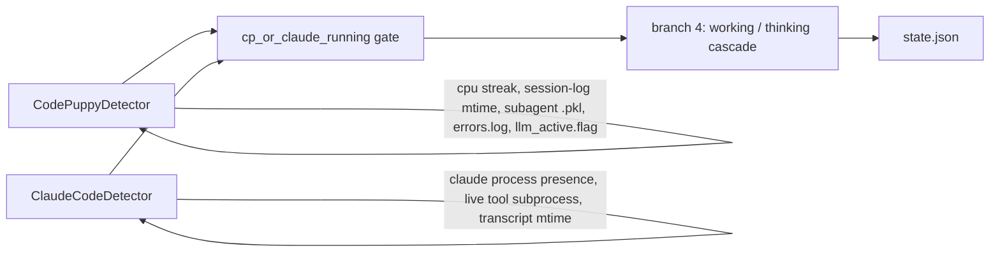

# Design — claude-code-detector

## Architecture: promote ClaudeCodeDetector into the CP-style cascade



Unlike the trigger-broadening detectors (git/terminal/ide), which stay in
the flat non-CP OR-fallback (branch 5, always labeled `thinking`),
`ClaudeCodeDetector` needs the same working/thinking *distinction* CP
gets — that's the whole point of this change. So it's wired into branch 4
alongside `CodePuppyDetector` rather than left in `_other_detectors()`.

## ClaudeCodeDetector fields and signals

| Field | Source | Role |
|---|---|---|
| `claude_code_running` | `find_claude_code_processes()` — exact process-name match `"claude"` | gates branch 4 (OR'd with `code_puppy_running`) |
| `shell_active` | `has_active_shell_children(procs)` (reused as-is from watcher.py) — live non-shell child under `claude`, at any depth | → `working` (OR'd with CP's `shell_active`) |
| `transcript_age` | seconds since the most-recently-modified `~/.claude/projects/*/*.jsonl` | proxy for "Claude is doing something" |
| `streaming` | `transcript_age < STREAMING_STALE_SEC (20s)` | → `thinking` (OR'd with CP's `llm_streaming`), same role as CP's `llm_active.flag` heartbeat |
| `cpu_percent` | `aggregate_cpu(procs)` | diagnostic only (`squid why`), not used for gating — see proposal Non-goals |

`is_busy(now) = shell_active or streaming`. `is_celebrating` / `is_grooving`
always `False` (documented non-goal — no reliable signal).

### Why cmdline-basename match, not `Process.name()`

Initially assumed an exact `process_iter(["pid","name"])` name match
would work, since `ps aux` shows `claude`'s `comm` column as exactly
`claude`. **That assumption was wrong** — verified empirically
(2026-08-14) against the live process: `psutil.Process.name()` returns
`"2.1.227"` (the basename of the versioned install path,
`~/.local/share/claude/versions/2.1.227`), not `"claude"`. `ps`'s
`comm` resolves through a different, more permissive path than
psutil's `name()` on macOS. `cmdline()[0]` is reliable (`["claude"]`),
so the detector matches on the basename of `cmdline()[0]` instead —
same defensive, per-process-try/except, no-bulk-prefetch pattern as
`find_code_puppy_processes` (bulk-prefetching `cmdline` via
`process_iter([...])` can raise an uncaught `SystemError` from
`KERN_PROCARGS2` on macOS).

### Why live-tool-subprocess detection reliably tracks Bash-tool calls

Empirically verified on this Mac (2026-08-14): the `claude` process
spawns a fresh `zsh` child per Bash-tool invocation that exits when the
command completes — same lifecycle as Code Puppy's bash-per-tool-call
model, which is exactly what `has_active_shell_children`'s
presence-based (not age-gated) allowlist check was built for. A
long-lived sibling process (`caffeinate`, spawned once for the session
to keep the Mac awake) is correctly excluded because it isn't in
`SHELL_CHILD_NAMES`'s allowlist.

**Known gap**: in-process tool calls (Edit/Write/Read, and possibly
Glob/Grep) don't spawn a subprocess, so `shell_active` only catches
Bash-tool activity. The `streaming` signal (transcript recency) is the
backstop that catches everything else, at the cost of coarser
granularity (labeled `thinking` rather than `working` when no subprocess
evidence exists — see the merge table below).

### Why transcript mtime, not JSONL content parsing

`~/.claude/projects/<slug>/<session>.jsonl` is appended to continuously
while Claude streams or a tool call resolves (observed staying <5s stale
throughout an active turn on this machine). Tail-sampling the file
showed some trailing lines are non-conversational bookkeeping entries
(`last-prompt`, `ai-title`, `mode`, ...), not just `user`/`assistant`
turns — so "parse the last line's role/content shape" is not a stable
contract to build on. Mtime-only keeps this detector as robust as
`GitDetector` (which also never reads file content) and side-steps an
undocumented, private on-disk format.

### Discovery caching (mirrors GitDetector)

`~/.claude/projects/*/*.jsonl` is globbed and cached for
`DISCOVERY_CACHE_SEC = 60`, with candidates older than
`CANDIDATE_MAX_AGE_SEC = 900` (15 min) dropped from the cached list so
the working set stays small as session history accumulates over months.
Within the cache window, only the cached candidates' mtimes are
re-`stat`'d every tick (cheap). **Trade-off**: a session file in a
brand-new project directory can take up to 60s to be picked up — same
latency trade-off GitDetector already accepts for repo discovery.

## Cascade merge (watcher.py `_compute_inner`)

```
cp_or_claude_running = code_puppy_running or claude_code_running
shell_active_merged  = cp.shell_active or claude.shell_active
streaming_merged     = cp.llm_streaming or claude.streaming
```

| Branch | Condition | Unchanged from today? |
|---|---|---|
| 4a concerned | `code_puppy_running and error_age...` | Yes — stays CP-only (explicit `running` guard added since the outer gate broadened) |
| 4b working (shell) | `shell_active_merged` | Broadened |
| 4b working (writing) | `cp.sustained_busy and cp.tool_activity_age < window` | Yes — stays CP-only (autosave-mtime signal has no Claude equivalent) |
| 4b-prime sticky hold | `now < working_hold_until and (cp.sustained_busy or cp.cpu>5 or streaming_merged or shell_active_merged)` | Broadened — otherwise the LLM-gen-gap grace window never applied to Claude-only sessions |
| 4c-prime thinking (streaming) | `streaming_merged` | Broadened |
| 4c thinking (cpu heuristic) | `cp.sustained_busy` | Yes — stays CP-only (Claude's CPU heuristic is a documented non-goal) |

`state.json`'s existing `code_puppy_running` field keeps its current
CP-only meaning (tests assert this). A new `claude_code_running` field
is added to `PetState` — additive, doesn't change any existing key's
semantics.

`_other_detectors()` (the flat non-CP fallback used by git/terminal/ide)
now excludes `claude_code` by name too, so it isn't double-counted once
promoted into branch 4.

## Settings

`DEFAULT_TRIGGERS["claude_code"] = True` in `detectors.py`, following the
git/ide precedent (on by default — no observed misfire risk, unlike raw
terminal detection). `install.sh`'s generated `settings.json` gets
`"claude_code": true` and its **`"terminal": true` hardcode is corrected
to `false`**, matching `DEFAULT_TRIGGERS`'s already-documented rationale.
The interactive wizard gets a `claude_code` prompt mirroring the existing
`code_puppy` one, for parity.

## Decisions

### D1: Promote into branch 4, don't leave it in the flat fallback
This is the entire point of the change — flat `thinking` for everything
is the bug being fixed.

### D2: Transcript-mtime as the streaming proxy, not JSONL parsing
Grounded in an empirical check (tail-sampling the live transcript during
this exact investigation) rather than assumption; documented as
revisit-if-inaccurate, same posture the project already takes toward
tunable thresholds (see `watcher.py`'s CPU-threshold history: 15.0 →
20.0, streak 2 → 4).

### D3: No CPU-based busy heuristic for Claude Code
Explicit non-goal — CPU occupancy while streaming a network response
isn't a reliable "busy" proxy the way local CPU-bound TUI rendering is
for Code Puppy.

### D4: `code_puppy_running` semantics untouched; new field added instead
Lower risk than overloading an existing, tested field.
