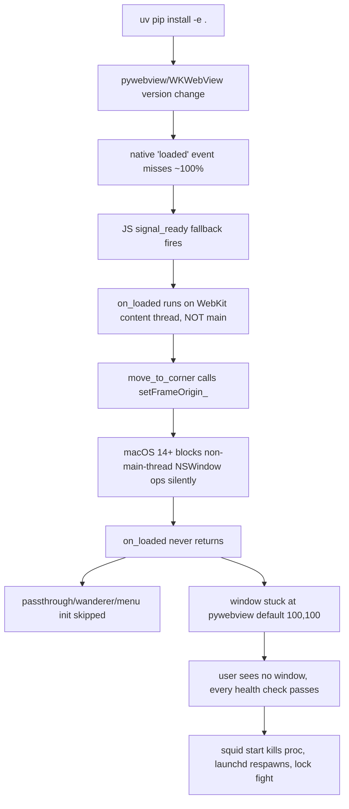

# Design — Safe Startup Verification

## Context

Tonight's incident chain (kennel drawer 239 + commit 0d21f15):

The bug lived undetected for an unknown duration because watcher and JS
bridge ran on healthy threads. Window state is the actual user-visible
contract; nothing else verifies it.

## Decisions

### D1: Decorator pattern over centralized facade

**Choice:** Provide `@cocoa_main_thread` decorator; apply to existing
functions in place. Do NOT route all Cocoa access through a single
facade module.

**Rationale:** A facade would require rewriting every callsite and would
fight pywebview's own NSWindow access pattern. The decorator is opt-in
per function but mechanically uniform — and trivially auditable with
grep.

### D2: AppHelper.callAfter (not performSelectorOnMainThread)

**Choice:** Use `PyObjCTools.AppHelper.callAfter` exclusively.

**Rationale:** It's already imported and used in two existing on_loaded
dispatches; consistent with codebase. `performSelectorOnMainThread_` is
NSObject-only and adds boxing overhead.

### D3: Fire-and-forget by default; blocking variant as escape hatch

**Choice:** Default `@cocoa_main_thread` returns `None` immediately when
off-main (caller cannot rely on return value). A separate
`@cocoa_main_thread_blocking` synchronously waits with 5s timeout.

**Rationale:** Most NSWindow setters are side-effect-only and don't need
return values. Blocking variant carries thread-sync cost and a real
deadlock risk if main thread is itself waiting on the caller. Make the
safe path the default; force the expensive path to be explicit.

### D4: `squid doctor` is a separate subcommand, not auto-run

**Choice:** `squid doctor` runs only when explicitly invoked. NOT
auto-triggered on every `squid start`.

**Rationale:** Doctor takes ~1s and Squid should start fast. The launcher
gets its own faster check (D5). Doctor is the "is anything wrong?" tool
users and CI invoke deliberately.

### D5: Launcher healthcheck = subset of doctor

**Choice:** `bin/squid start` runs three doctor checks inline (process +
state.json fresh + window in CGWindowList). Full doctor adds three more
(launchd job + window-in-saved-corner + full-startup-log).

**Rationale:** Start command needs to return quickly. The three fast
checks catch the bug we hit tonight (window-in-CGWindowList would have
shown the (100,100) wedge) without doing the slow log-scraping work.

### D6: Stop launchd FIRST, then kill the process

**Choice:** `bin/squid start` (when replacing an unhealthy instance) runs
`launchctl bootout` BEFORE `kill`. Bootstraps launchd back at the end.

**Rationale:** Tonight's cascade ("REFUSING TO START" 8x) happened
because launchd KeepAlive instantly respawned the dead process which
grabbed the singleton lock before our new CLI-started attempt could.
Booting out launchd first guarantees no respawn race.

### D7: CGWindowList for verification, not just process introspection

**Choice:** `squid doctor` queries
`Quartz.CGWindowListCopyWindowInfo(kCGWindowListOptionOnScreenOnly)`
to verify the window's actual rendered state — position, size, alpha,
on-screen status.

**Rationale:** This is the ONLY way to know the window is actually
visible to the user. Process liveness, state.json freshness, and even
log lines can all be green while the window is invisible (proven
tonight). CGWindowList is the ground truth.

### D8: CI smoke test runs as background process under macOS-latest

**Choice:** GitHub Actions workflow boots Squid via `python -m squid_pet
&`, sleeps 10s, runs `squid doctor`, asserts exit 0, captures logs on
failure.

**Rationale:** GHA macos-latest runners have a real WindowServer.
Headless testing of pywebview is not reliable. Backgrounding + sleep +
doctor is the simplest pattern that works.

## Migration

For each existing direct NSWindow/NSApp call:
1. Move the call body into a helper function named `_<verb>_<noun>`.
2. Decorate the helper with `@cocoa_main_thread`.
3. Replace original callsite with helper invocation.
4. Run audit grep to confirm zero remaining violations.

Estimated callsites to migrate (from tonight's audit, before false-
positive triage):
- `window.py:141` (in `move_to_corner` body — false positive after dispatch wrap)
- `window.py:162` (in drag handler — needs verification)
- `menu.py:290` (`makeKeyAndOrderFront_` — needs verification)
- `passthrough.py:168` (`setIgnoresMouseEvents_` — already callAfter-wrapped)

## Test strategy

- Unit test the decorator: thread detection, dispatch behavior, blocking
  variant timeout.
- Integration test `squid doctor` against a known-good launched instance.
- Regression test: synthetically revert commit `0d21f15` in a test
  fixture and assert `squid doctor` returns FAIL with the expected
  diagnostic.
- CI smoke test: the full flow on a clean macOS-latest runner.

## Open questions

- Should the pre-commit hook fail commits, or just warn? Lean: fail.
- Should `squid doctor` check pywebview/PyObjC versions against a known-
  compatible list? Deferred — too brittle for v1.
- Does `bin/squid restart --doctor` belong here or in distribution-installer?
  Lean: here, since the diagnostic value lives with this change.
